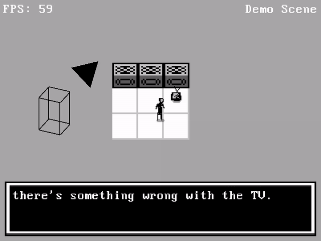

# pyengine

Note: This isn't meant for public use. It has bugs, it's not well documented, and it's not very good. But I like it :)

This repo contains some of the utility functions I use in my pygame projects.

In particular:
 - Quick and easy OpenGL setup (renderengine.py).
 - Better window creation, resizing, and fullscreen management (window.py).
 - Pixel scaling based on window size (renderengine.py).
 - A layer-based sprite rendering system (renderengine.py).
 - Some helpful methods involving music & sounds (music.py + sounds.py). 
 - A more convenient way to handle keyboard + mouse inputs (inputs.py).
 
 There's also a tiny demo scene to help illustrate the setup.
 
